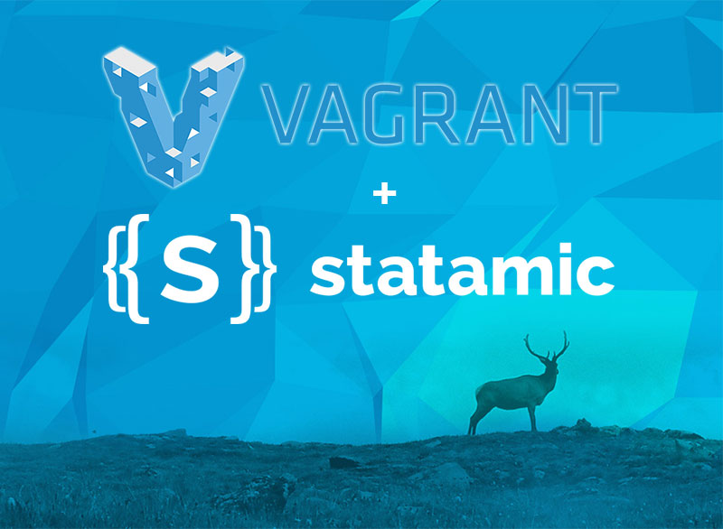

# Vagrant + Statamic

A happy union of [Vagrant](http://www.vagrantup.com/) and [Statamic CMS](http://www.statamic.com) to allow you to develop your sites in peace without worrying about the next system update breaking something.

## Works on

+ 
+ 

## Requirements

Currently working and tested on OSX only but should work just fine on Linux/BSD system and even Windows.

+ [Virtualbox](https://www.virtualbox.org/wiki/Downloads)
+ [Vagrant](http://www.vagrantup.com/downloads.html)
+ A copy of [Statamic](http://statamic.com/)

## How?

### 1. Install Requirements

#### Virtualbox

You can get it [here](https://www.virtualbox.org/wiki/Downloads).

#### Vagrant

You can get it [here](http://www.vagrantup.com/downloads.html).

Confirm that `Vagrant` is good to go with `$ which vagrant` which should give you something like `/usr/bin/vagrant` in the terminal window.

#### Get a copy of Statamic

You can get it [here](http://statamic.com/). Place the source code in `./vagrant-statamic/source/statamic` folder.

### 4. Start the project

Navigate to the repository folder

    cd ./vagrant-statamic

start vagrant

    vagrant up

### 5. Vagrant Up + Rsync!

Want top run `vagrant up` followed by the new hotness in `Vagrant 1.5` that is `Rsync Auto Resync`, use this shortcut.

    ./vagrant-up.sh

if you have any issues running it, try gicing it execution permissions first

    chmod +x vagrant-up.sh

---
### What happens here?

`vagrant` will read the `Vagrantfile` and based on the configuration defined will create a virtual machine using `Virtualbox`. It'll configure the following:

1. Download and create a VM using Ubuntu Linux 32bit. (lines 14-15)
2. Setup a virtual network and give the vm the ip address of `10.0.1.100` (line 19)
3. Set the hostname for the vm to be "web" (line 32)
4. Setup `port forwarding` from your `local port 80` to `port 8080 on the vm` (line 41).
5. Link `./source` folder in the repository folder to `/var/www` on the vm (line 46). As this will be done using `NFS`, vagrant will need your root password. **Windows users**, please see special note further in the README.

### Things that will be installed using `Ansible` provisioning tool.

- **os** - Ubuntu (32bit)
- **apache** - 2.4.x
- **mod_php** - 5.5.x
- **mysql** - NO!

**Note for Windows Users:**

Windows users will need to use **Shared Folders** instead of **NFS folder** for source code access.

Goto *Vagranfile* and comment out **line 46** and uncomment **line 49**. This will get better in `Vagrant 1.5`

### 5. Adjust `.htaccess` file

rename `sample.htaccess`

    mv sample.htaccess .htaccess

### 6. Accessing the site

All going well, you should be able to get to the site [http://10.0.1.100](http://10.0.1.100).

**Note:** If you'd like to use a different IP address, adjust this in the `Vagrantfile`. You will need to run `vagrant destroy`(destroys the vm) command followed by `vagrant up`(starts up/begins provisioning of the vm).

### Bonus: update Host file

Vagrant configures the vm to accept requests to the domain `statamic.dev`.

What you'll need to do is add the following to your `/etc/hosts`

    10.0.1.100 statamic.dev

